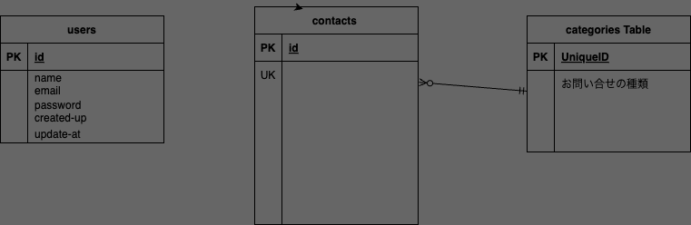

## アプリケーション名
確認テスト：お問合せフォーム

## ER図


## 環境構築
http://localhost/

## 使用技術(実行環境)
Laravel 8.x
MySQL
Nginx
Docker/Docker-compose
```

リポジトリからダウンロードして下さい
git clone git@github.com:ayaka0601/ayaka_test.git

srcディレクトリに.envファイルを作成し
docker-compose.ymlのDBの設定を記入して下さい
$ cp .env.example .env
---
DB_HOST=mysql
DB_DATABASE=laravel_db
DB_USERNAME=laravel_user
DB_PASSWORD=laravel_pass
---

dockerコンテナを構築して下さい
$ docker-compose up -d --build
$ docker-compose exec php bash
> composer install
> php artisan key:generate
> php artisan migrate
> php artisan db:seed
http://localhostにアクセスして
"The stream or file could not be opened"というエラーが発生した場合は
ファイルの権限を変更して対応お願いします

大変申し訳ありませんが完成できておらず、お問い合せフォーム入力画面しか完成しておりません。
何卒、よろしくお願いいたします。
```